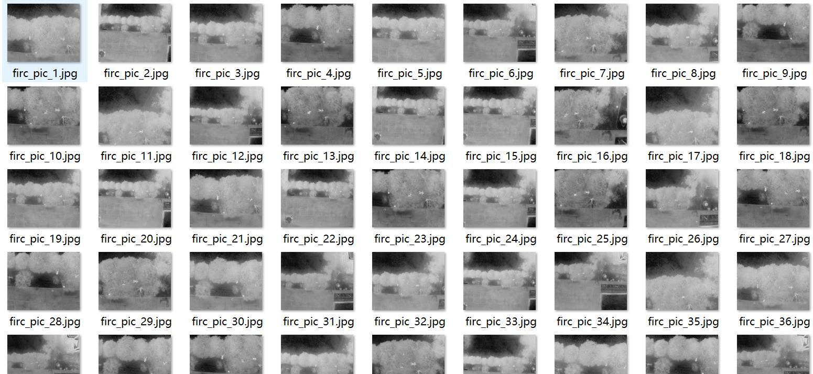
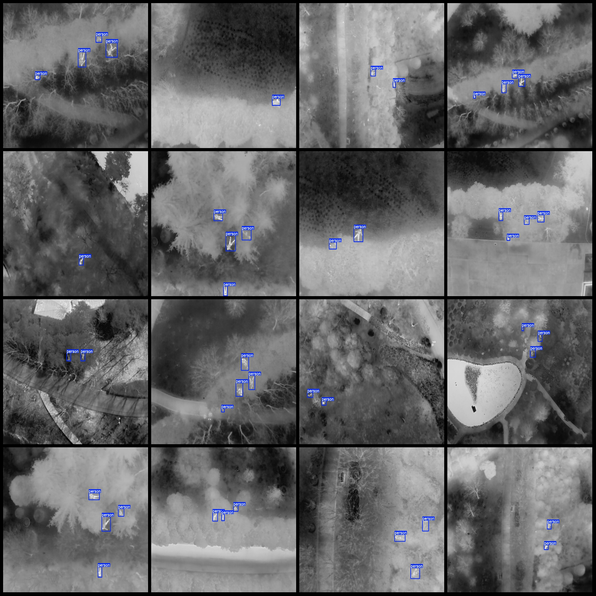
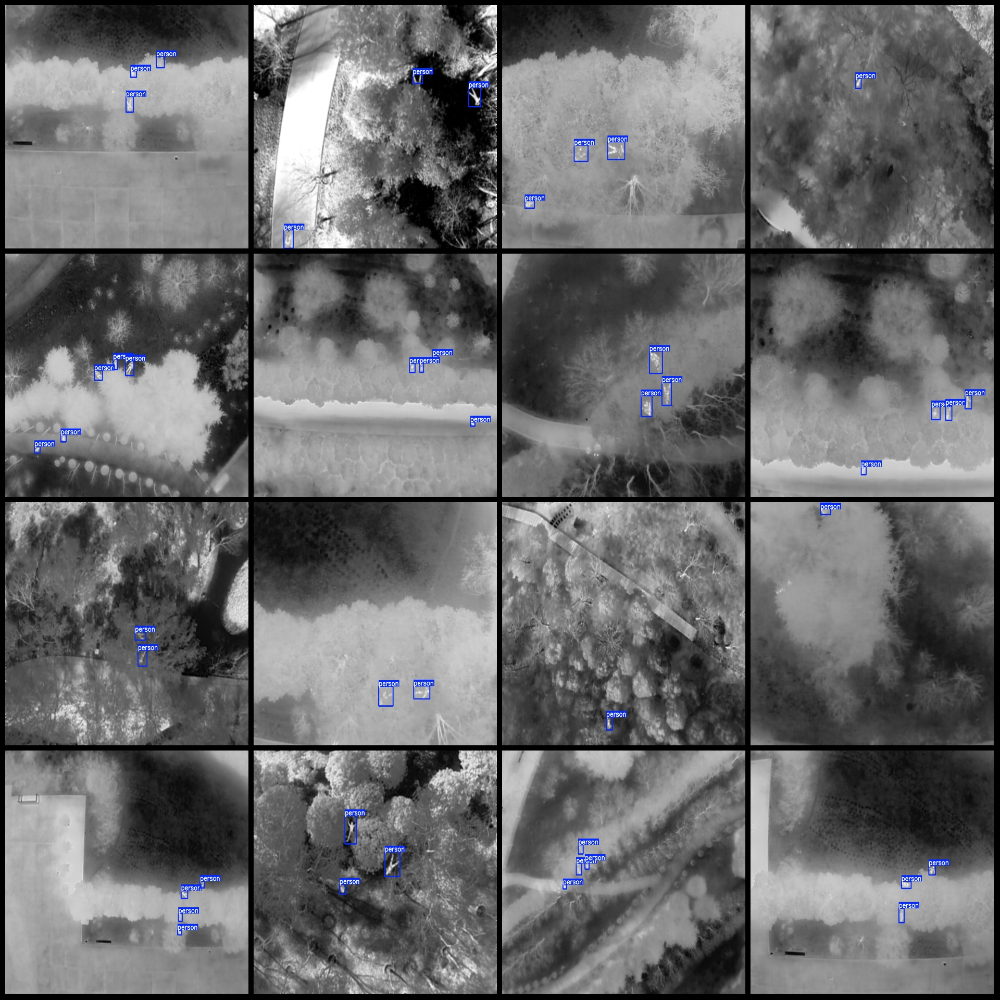

# Drone Viewpoint Infrared Image Obstruction Case Person Emergency Search and Rescue Detection Dataset VOC+YOLO Format

**Dataset Format:** Pascal VOC format + YOLO format (without split path txt files, only containing jpg images and corresponding VOC format xml files and yolo format txt files)

**Number of Images (jpg Files):** 8767
**Annotation Number (xml Files):** 8767
**Annotation Number (txt Files):** 8767
**Annotation Category Count:** 1
**Annotation Category Name:** ["person"]

Each category has the number of bounding boxes:
- "person" bounding box count = 26803
- Total bounding box count = 26803
- Each category occupies the number of images:
- "person" occupies the number of images = 8767

Image resolution: 1280x1024

Using annotating tool: labelImg
Annotation rules: draw a rectangle around the category

Special notice: The dataset does not have been divided into training, validation, or test sets. Please divide them on your own.

Special declaration: This dataset does not guarantee the accuracy of the trained models or weight files.

Image preview:

**Annotation Example:**

## Image

Here is a pay link on Stripe ( https://buy.stripe.com/3cs8yP7sY87d0vu9AB ). Please contact me lonlonago@foxmail.com after funding $89, and I will send you a complete data files , thank you!

